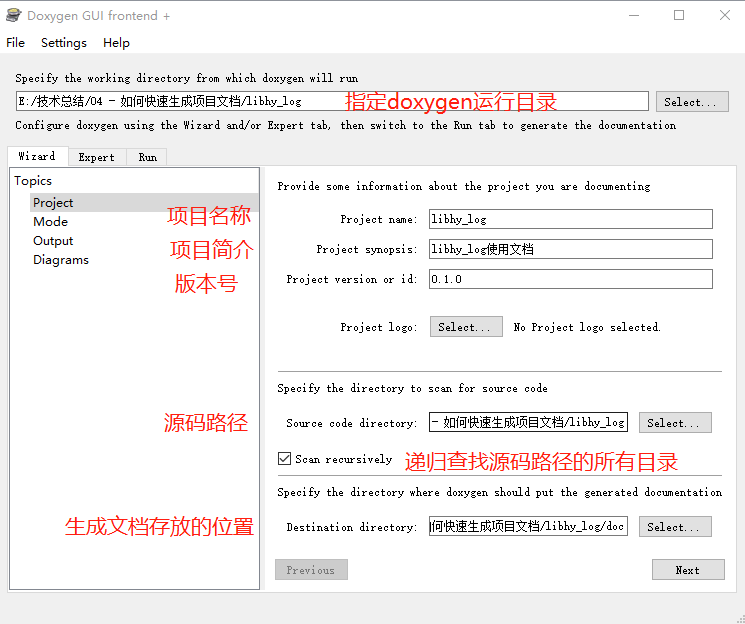
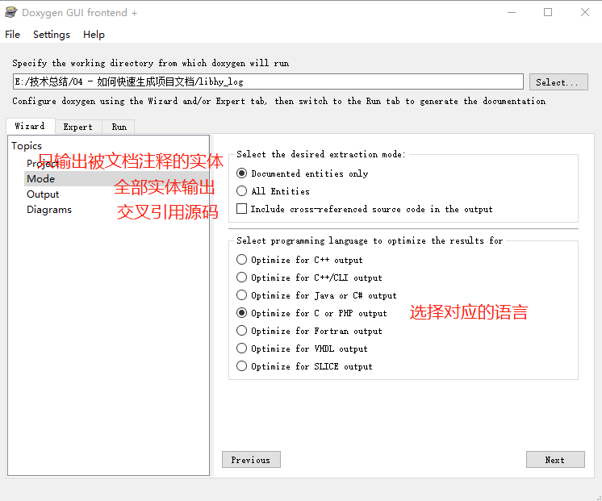
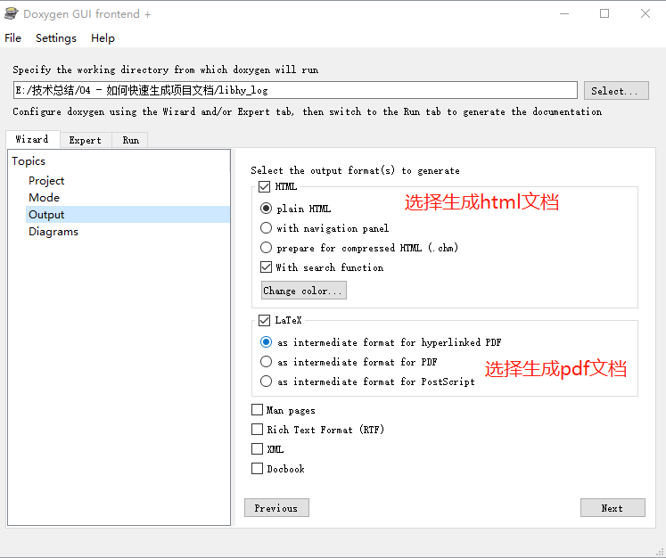
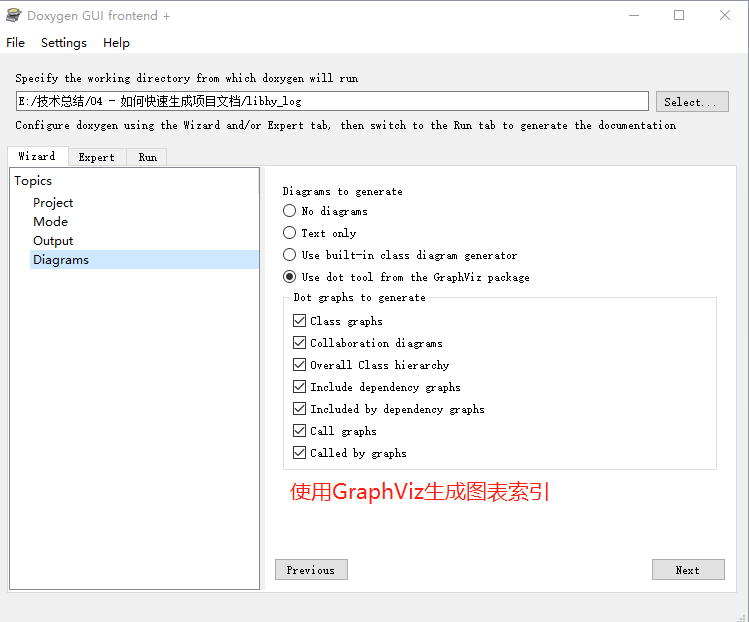
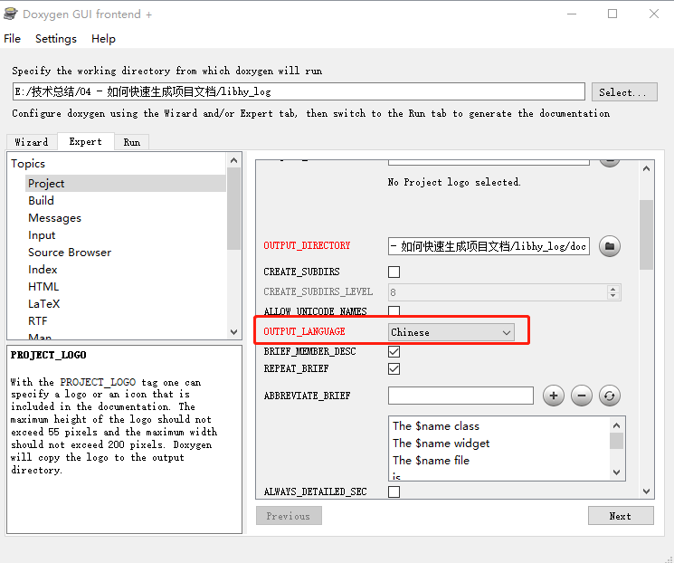
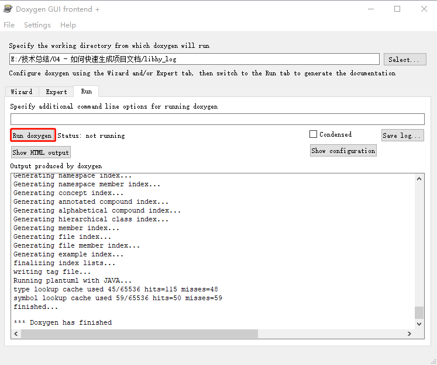

# 如何快速生成项目文档

---

[TOC]

## 概述

---

### [Graphviz](https://graphviz.org/)

Graphviz是一个开源的图形可视化工具集，用于创建和绘制各种类型的图形。它提供了一种简单而强大的方法来描述和可视化复杂的关系和结构。

Graphviz支持多种图形类型，包括有向图、无向图、树状图、网络图等。它使用一种基于文本的描述语言来描述图形，称为DOT语言。通过编写简单的文本描述，可以定义节点、边、样式和布局等图形属性。

使用Graphviz，您可以创建各种类型的图形，如流程图、组织结构图、类图、时序图、状态转换图等。您可以通过自定义节点和边的样式、颜色和形状来表达您的意图和设计。

Graphviz还提供了多种布局算法，用于自动将节点和边排列成有吸引力的图形。这些算法可以根据图形的大小和复杂度进行调整，以便更好地呈现图形的结构和关系。

Graphviz是一个跨平台的工具，可以在Windows、Mac和Linux等操作系统上使用。它还提供了多种接口和工具，如命令行工具、API接口和插件，方便与其他应用程序集成和使用。

总的来说，Graphviz是一个强大而灵活的图形可视化工具，可以帮助您通过简单的文本描述创建复杂的图形，并以美观的方式呈现图形的结构和关系。

下载地址: [Graphviz](https://graphviz.org/download/)

### [doxygen](https://www.doxygen.nl/index.html)

Doxygen是一款用于自动生成代码文档的工具。它支持多种编程语言，包括C++、Java、Python等，并能够从源代码中提取注释并生成清晰、易读的文档。

使用Doxygen，开发人员可以通过注释代码来描述函数、类、变量以及其他代码元素的用途、参数、返回值等信息。Doxygen会解析这些注释，并将其转换为各种格式的文档，如HTML、PDF、RTF等。这些文档可以作为代码的参考手册，帮助其他开发人员理解和使用代码。

Doxygen的一些主要特点包括：

* 支持多种编程语言：Doxygen能够处理C++、Java、Python等主流编程语言，并能够根据不同语言的特点生成相应的文档。

* 支持多种文档格式：Doxygen可以生成多种格式的文档，包括HTML、PDF、RTF、Man Pages等，开发人员可以根据需要选择合适的格式。

* 自动生成文档：Doxygen能够自动从源代码中提取注释，并根据一定的格式规则生成文档，减少了手动编写文档的工作量。

* 支持代码结构图：Doxygen可以生成代码的类结构图、调用图等，帮助开发人员更好地理解代码的结构和关系。

* 可定制性强：Doxygen提供了丰富的配置选项，可以根据项目的需求进行定制，包括文档样式、输出格式、注释格式等。

总的来说，Doxygen是一款强大而灵活的代码文档生成工具，可以帮助开发人员快速、准确地生成代码文档，提高开发效率和代码质量。

下载地址: [doxygen](https://sourceforge.net/projects/doxygen/) 

## 安装

---

* Windows

    通过安装包安装，Graphviz和doxygen只需要一路next就行

* ubuntu

```shell
sudo apt install doxygen graphviz
```

## 使用

下面以`libhy_log`举例

* `Project`设置如下，填写项目相关信息:



* `Mode`设置如下，选择编程语言:



* `Output`设置如下，选择文档的格式:



* `Diagrams`设置如下，选择生成图标相关索引:



* 设置中文输出



* 生成文档




## 源代码中的文档注释

* 文件注释

```c
/**
 * 
 * Release under GPLv-3.0.
 * 
 * @file    hy_log.h
 * @brief   log模块接口函数
 * @author  zhenquan.qiu
 * @date    17/08 2023 13:54
 * @version v0.1.0
 * 
 * @since    note
 * @note     note
 * 
 *     change log:
 *     NO.     Author              Date            Modified
 *     00      zhenquan.qiu        17/08 2023      create the file
 * 
 *     last modified: 17/08 2023 13:54
 */
```

* 函数注释

```c
/**
 * @brief 初始化log模块
 *
 * @param log_c 配置参数
 *
 * @return 成功返回0，失败返回-1
 */
hy_s32_t HyLogInit(HyLogConfig_s *log_c);
```

* 结构体注释

```c
/**
 * @brief 配置参数
 */
typedef struct {
    HyLogSaveConfig_s   save_c;             ///< 配置参数

    hy_u32_t            fifo_len;           ///< fifo大小，异步方式用于保存log
    const char          *config_file;       ///< 配置文件路径
} HyLogConfig_s;
```

* 变量注释

```c
hy_u32_t count;                             ///< 这是一个计数变量
```

* 枚举注释

```c
/**
 * @brief 打印等级定义
 *
 * @note 数字越小越紧急
 */
typedef enum {
    HY_LOG_LEVEL_FATAL,                     ///< 致命错误，立刻停止程序
    HY_LOG_LEVEL_ERROR,                     ///< 错误，停止程序
    HY_LOG_LEVEL_WARN,                      ///< 警告
    HY_LOG_LEVEL_INFO,                      ///< 追踪，记录程序运行到哪里
    HY_LOG_LEVEL_DEBUG,                     ///< 调试程序相关打印
    HY_LOG_LEVEL_TRACE,                     ///< 程序打点调试

    HY_LOG_LEVEL_MAX,
} HyLogLevel_e;
```

* 宏注释

```c
/**
 * @brief 默认配置，输出所有格式
 */
#define HY_LOG_OUTFORMAT_ALL                    \
(HY_LOG_OUTPUT_FORMAT_COLOR                     \
    | HY_LOG_OUTPUT_FORMAT_LEVEL_INFO           \
    | HY_LOG_OUTPUT_FORMAT_TIME                 \
    | HY_LOG_OUTPUT_FORMAT_PID_ID               \
    | HY_LOG_OUTPUT_FORMAT_FUNC_LINE            \
    | HY_LOG_OUTPUT_FORMAT_USR_MSG              \
    | HY_LOG_OUTPUT_FORMAT_COLOR_RESET)
```

