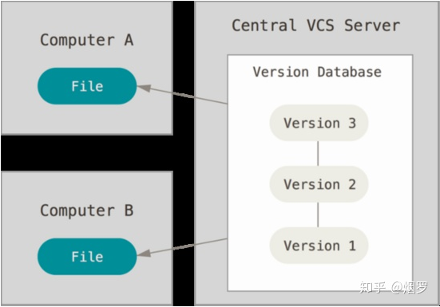
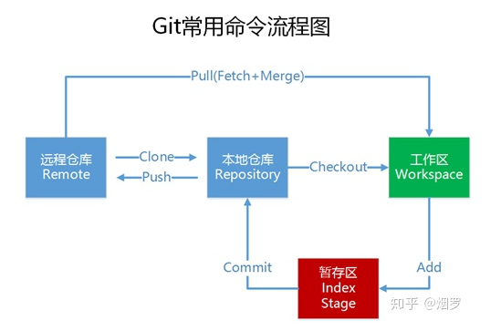
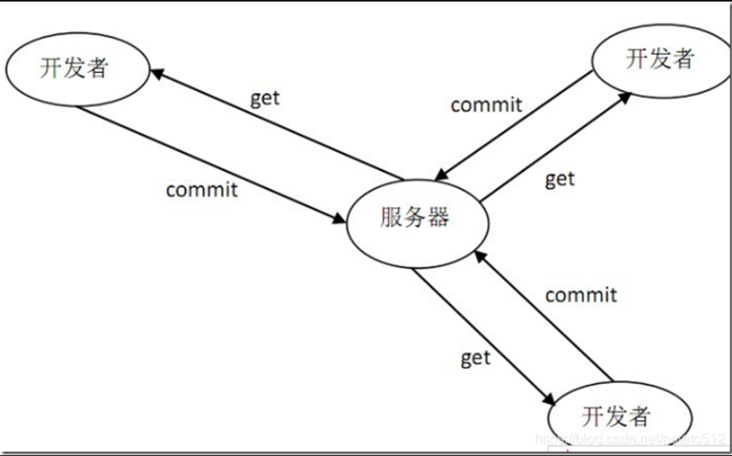

# 版本管理

---

[TOC]

## 什么是版本管理

---

版本控制是指在软件开发过程中对各种程序代码、配置文件及说明文档等文件变更的管理，版本控制系统能够随着时间的推进记录一系列文件的变化，方便以后随时回退到某个版本。

## 没有版本管理遇到的问题

---

平时开发不使用版本控制系统的情况下，我们习惯用复制整个项目目录的方式来保存不同的版本，或许还会改名加上备份时间以示区别。这种方式需要对项目频繁进行复制，最终整个工作区会比较臃肿混乱且时间一长很难区分项目之间的差异。

## 如何使用版本管理解决上面的问题

---

版本控制系统分为三大类

### 本地版本控制系统

---

为了解决这个问题，人们开发了本地版本控制系统，大多都是采用某种简单的数据库来记录文件的历次更新差异。最流行的是RCS，它的工作原理是在硬盘上保存补丁集（补丁指文件修订前后的变化），通过应用所有的补丁，可以重新计算出各个版本的文件内容。

本地版本控制系统一定程度上解决了手动复制粘贴代码的问题，但无法解决多人协作的问题。

### 集中式版本控制系统

---

集中式版本控制系统的出现是为了解决不同系统上的开发者协同开发，即多人协作的问题，主要有 CVS 和 SVN。集中式版本控制系统有一个单一的集中管理的中央服务器，保存所有文件的修订版本，由管理员管理和控制开发人员的权限，而协同工作的人们通过客户端连到中央服务器，从服务器上拉取最新的代码到本地开发，开发完成再提交到中央服务器。

集中式版本控制系统有许多优点：

* 操作比较简单，只需要拉取代码，开发，提交代码。
* 基本解决多人协作问题，每个人都可以从服务器拉取最新代码了解伙伴的进度。
* 同时管理员可以轻松控制各开发者的权限。
* 只需要维护中央服务器上的数据库即可。

 缺点也很明显：

* 本地没有全套代码，没有版本信息，提交更新都需联网跟服务器进行交互，对网络要求较高。
* 集中式的通病：风险较大，服务器一旦宕机，所有人无法工作，服务器磁盘一旦损坏，如果没有备份将丢失所有数据。

### 分布式版本控制系统

---

分布式版本控制系统很好地解决了集中式版本控制系统的缺点。首先，在分布式版本控制系统中，系统保存的不是文件变化的差量，而是文件的快照，即把文件的整体复制下来保存，其次，最重要的是分布式版本控制系统是去中心化的，当你从中央服务器拉取下来代码时，拉取的是一个完整的版本库，不仅仅是一份生硬的代码，还有历史记录，提交记录等版本信息，这样即使某一台机器宕机也能找到文件的完整备份。

分布式版本控制系统有许多优点：

* 适合分布式开发，强调个体；
* 公共的服务器压力和数量都不会太大；
* 速度快， 成熟的架构，开发灵活；
* 任意两个开发者之间可以很容易的解决冲突；
* 离线工作，管理代码成本低，不需要依赖服务器；
* 部署方便。基本上下个命令就可以用；
* 良好的分支机制，可以让主干代码保持干净。

 缺点：

* 资料少，学习成本比较大，学习周期比较长，要求人员素质比较高；
* 不符合常规思维；
* 对中文支持不是很友好，图形界面支持差，使用难度大, 不易推广。
* 拉去的版本是一个完整的版本库，可以查看全部的历史记录和版本信息，保密性较差。

## 版本发布

---

### 版本的命令规范

---

例如：1.1.1_beta。

软件版本号由四部分组成，第一个1为主版本号，第二个1为子版本号，第三个1为阶段版本号，第四部分为希腊字母版本号，希腊字母版本号共有5种，分别为：base、alpha、beta、RC、release。

> note: 不太建议使用希腊字母版本号

#### 版本号修改规则

---

* 主版本号

当功能模块有较大的变动，比如增加多个模块或者整体架构发生变化。此版本号由项目决定是否修改。

* 子版本号

相对于主版本号而言，子版本号升级对应的是软件功能有一定的增加或变化，比如优化了tcp链接、增加了分选速度等功能。此版本号由项目决定是否修改。

* 阶段版本号

一般是 Bug 修复或是一些小的变动，要经常发布修订版，时间间隔不限，修复一个严重的bug即可发布一个修订版。此版本号由项目经理或者开发人员决定是否修改。

* 希腊字母版本号
此版本号用于标注当前版本的软件处于哪个开发阶段，当软件进入到另一个阶段时需要修改此版本号。此版本号由开发人员决定是否修改。

#### 软件版本阶段说明

---

* Base：

整体架构的实现，主要模块和详细功能留有桩函数或直接输出打印。

* α（Alpha）版：内测版。

软件的初级版本，表示该软件在此阶段以实现软件功能为主，通常在开发人员跟测试人员之间内部流通。一般而言，该版本的bug较多，bug发现后应及时告知开发人员。

* β（Beta）版：公测版。

该版本相对于α版已有了很大的改进，消除了严重的错误比如死机，但还是存在着一些缺陷，需要经过多次测试来进一步消除。该阶段测试人员发现的bug需要上bug管理系统，且进行整个流程的测试。

* RC 版：

是 Release Candidate 的缩写，意思是发布倒计时，候选版本，该版本已经相当成熟了，完成全部功能并清除大部分的BUG，基本上不存在导致错误的BUG，与即将发行的正式版相差无几。该版本可以直接输出到一到两个客户那里验证，为大规模推广提供参考。

* Release 版：

该版本意味“最终版本”，在前面版本的一系列测试版之后，终归会有一个正式版本，是最终交付用户使用的一个版本。该版本有时也称为标准版。安装该版本的客户，一般情况下不会对他进行升级，除非有新需求或者出现bug。

### 版本号修改举例说明

---

比如版本号为：1.0.0_alpha ，此时为内部测试阶段

* 开发人员修复了测试人员提交的bug并经测试人员测试验证关闭bug之后，发布到外网时，此时就进入了软件的下一个阶段，版本号可改为：1.0.0_beta。

* 如果修复了一些重大Bug 并按照流程发布到外网时就可发布一个修订版，如1.0.1_beta。

* 如果对软件进行了一些功能上的改进或增强，进行了一些局部变动的时候要修改次版本号，如：1.1.0_beta（上一级有变动时，下级要归零）。

* 当功能模块有较大变动，增加模块或整体架构发生变化时要修改主版本号，如新增加了退款功能，则版本号要改为：2.0.0_beta 。

* 紧急情况：如果bug比较紧急可跳过一般流程，由开发人员尽快修复bug，测试确认之后直接发布该版本的beta版。

## 版本管理工具git

---

Git 是 Linux 发明者 Linus 开发的一款分布式版本控制系统，是目前最为流行和软件开发着必须掌握的工具。

### git基础

---

Git 是一个分布式版本控制系统，保存的是文件的完整快照，而不是差异变换或者文件补丁。保存每一次变化的完整内容。

Git 每一次提交都是对项目文件的一个完整拷贝，因此你可以完全恢复到以前的任何一个提交。Git 每个版本只会完整拷贝发生变化的文件，对于没有变化的文件，Git 只会保存一个指向上一个版本的文件的指针，即对一个特定版本的文件，Git 只会保存一个副本，但可以有多个指向该文件的指针。

### git基本命令

---

如上图，使用 Git 的基本工作流程就是：

* 从远程仓库将项目clone到本地；
* 在本地工作区进行开发：增加、删除或者修改文件；
* 将更改的文件add到暂存区域；
* 将暂存区的更新commit到本地仓库；
* 将本地仓库push到服务器。

Git 工程在本地有三个工作区域：

* 工作区：进行日常开发的区域。
* 暂存区域：运行 git add 命令后文件保存的区域，也是进行 commit 的区域。
* 本地仓库：本地版本库，记录工程的提交历史，意味着数据永远不会丢失。

对应的，文件有四种状态：

* 未跟踪的（untracked）：表示在工作区新建了某个文件，还没有add。
* 已修改（modofied）：表示在工作区中修改了某个文件，还没有 add。
* 已暂存（staged）：表示把已修改的文件已add到暂存区域。
* 已提交（commit）：表示文件已经commit到本地仓库保存起来了。

### git分支

---

几乎所有的版本控制系统都以分支的方式进行操作，分支是独立于项目主线的一条支线，我们可以在不影响主线代码的情况下，在分支下进行工作。

### git工作流程

---

如上图，首先，项目存在两个长期分支：

* 主分支（maste）：专门用于部署以及负责线上代码回滚的分支，是最为稳定的一个分支，master的代码等于或者落后于develop的代码。
* 开发分支（develop）：专门存放经过测试之后，保证代码无bug的代码分支。开发的时候主要依托于develop分支开发，基于develop分支新建分支，经过严格测试之后，才能合并到develop中，保证develop代码的稳定性（也就是日常开发中不要轻易修改develop分支代码）。

开发过程中会从develop分支中衍生出临时开发分支：

* 项目开发分支或功能分支（feature）：此分支特点是周期长、需要团队协作、代码量大。工作方式是需要创建本地以及远程feature分支，代码基于develop分支代码，经过开发、测试之后，最终合并到develop分支上。当项目上线之后，分支会保留一段时间，直至最终删除。
* 紧急bug、其他问题修复分支（hotfix）：此分支特点是修改时间短、优先级高、代码量稍小、改完之后急需测试、上线。此分支代码也是基于develop。此分支会是团队协作或者单人、团队协作工作方式会类似feature分支，单人只需构建本地分支即可满足开发要求，当修复上线一段时间后，即可删除。
* 预发布分支（release）：此分支是项目开发完成，经过测试没有问题之后，从develop分支分出用于项目的预发布，预发布一段时间没有问题之后合并到master分支进行正式发布。

### 项目： 开发一个计算器

---

#### 创建项目

---

* 创建并设置好项目，比如编译环境等，此时版本号为`0.1.0`

* 根据项目需求文档，构思项目的整体目录，此时版本可以设置为`0.2.0`

* 增加新需求

`feat/sub`/`feat/div`/`feat/multiply`

* 特定项目需求，分支一直持续

* bug紧急修复

* 回退到特定版本

* 用tag发布软件

## 版本管理工具svn

### svn基础

---

SVN是一个增量式的版本控制，它不会将各个版本的副本都完整的保存下来，而只会记录下版本之间的差异，然后按照顺序更新或者恢复特定版本的数据。这使得服务端的存储量会非常低。

### svn基本命令

---

### svn分支

---

### svn工作流程

---

### 项目： 开发一个计算器

#### 创建项目

---

* 创建版本库

> note: 创建版本库，可以在服务器上或者在本机的另外一个目录上。如果是服务器，地址格式为`svn://ip地址或者域名/calc`，如果是本机上，地址格式为`file:///E:\技术总结\02- 版本管理\calc`

* 创建并设置好项目，比如编译环境等，此时版本号为`0.1.0`

设置忽略文件

已经提交了的文件，想把它踢出版本库中

设置阶段性版本tag

* 根据项目需求文档，构思项目的整体目录，此时版本可以设置为`0.2.0`

* 增加新需求

`feat/sub`/`feat/div`/`feat/multiply`

增加add功能分支

合并分支

删除不需要的分支

取消更改`revert`

* 特定项目需求，分支一直持续

* bug紧急修复

* 回退到特定版本

* 用tag发布软件

