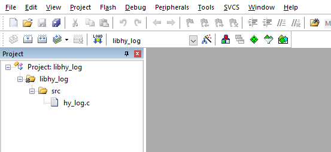
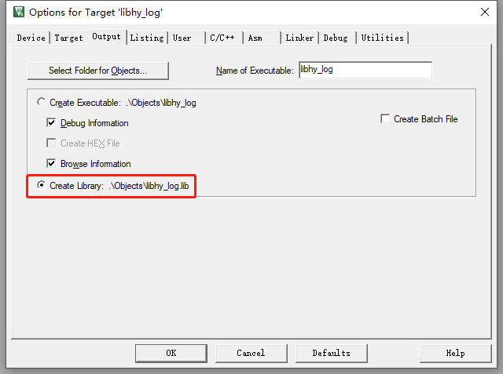
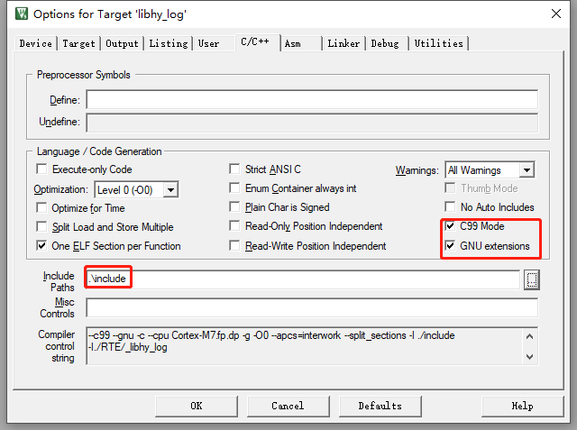
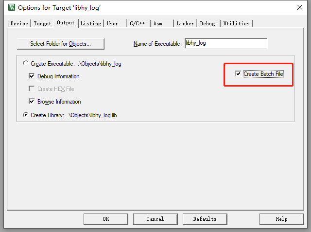
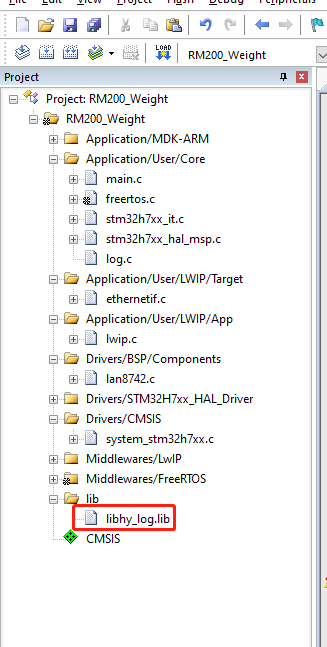
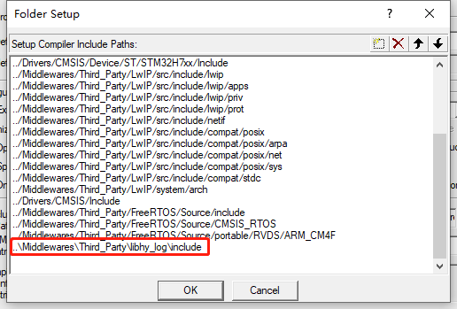
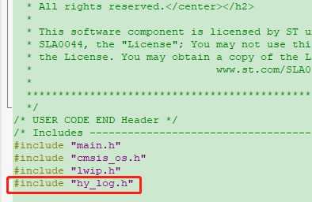
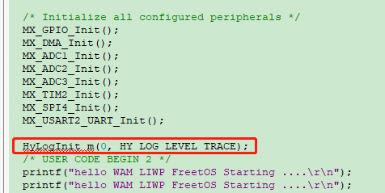
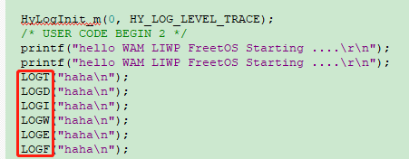
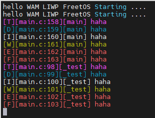

# keil库使用方法

---

[TOC]

## 创建libhy_log

---

### 使用keil创建工程

---

#### 用keil创建工程，取名`libhy_log`

#### 在工程中增加文件

增加源文件、头文件和测试文件，目录如下：

```shell
.
├── DebugConfig
│   └── Target_1_STM32H743ZITx_1.1.0.dbgconf
├── example
│   └── hy_log_demo.c
├── include
│   └── hy_log.h
├── libhy_log.uvoptx
├── libhy_log.uvproj.saved_uv4
├── libhy_log.uvprojx
├── Listings
├── Objects
└── src
    └── hy_log.c
```

`hy_log.h`

```c
/**
 * 
 * Release under GPLv-3.0.
 * 
 * @file    hy_log.h
 * @brief   
 * @author  gnsyxiang <gnsyxiang@163.com>
 * @date    07/07 2023 19:36
 * @version v0.0.1
 * 
 * @since    note
 * @note     note
 * 
 *     change log:
 *     NO.     Author              Date            Modified
 *     00      zhenquan.qiu        07/07 2023      create the file
 * 
 *     last modified: 07/07 2023 19:36
 */
#ifndef __LIBHY_LOG_INCLUDE_HY_LOG_H_
#define __LIBHY_LOG_INCLUDE_HY_LOG_H_

#ifdef __cplusplus
extern "C" {
#endif

#include <stdint.h>

/**
 * @brief 打印等级定义
 *
 * @note 数字越小越紧急
 */
typedef enum {
    HY_LOG_LEVEL_FATAL,                     ///< 致命错误，立刻停止程序
    HY_LOG_LEVEL_ERROR,                     ///< 错误，停止程序
    HY_LOG_LEVEL_WARN,                      ///< 警告
    HY_LOG_LEVEL_INFO,                      ///< 追踪，记录程序运行到哪里
    HY_LOG_LEVEL_DEBUG,                     ///< 调试程序相关打印
    HY_LOG_LEVEL_TRACE,                     ///< 程序打点调试

    HY_LOG_LEVEL_MAX,
} HyLogLevel_e;

/**
 * @brief 配置参数
 */
typedef struct {
    HyLogLevel_e        level;              ///< 打印等级
} HyLogSaveConfig_s;

/**
 * @brief 配置参数
 */
typedef struct {
    HyLogSaveConfig_s   save_c;             ///< 配置参数

    uint32_t            fifo_len;           ///< fifo大小，异步方式用于保存log
} HyLogConfig_s;

/**
 * @brief 初始化log模块
 *
 * @param log_c 配置参数
 *
 * @return 成功返回0，失败返回-1
 */
int32_t HyLogInit(HyLogConfig_s *log_c);

/**
 * @brief 初始化log模块
 *
 * @param _fifo_len fifo大小
 * @param _level 等级
 *
 * @return 成功返回0，失败返回-1
 */
#define HyLogInit_m(_fifo_len, _level)      \
({                                          \
    HyLogConfig_s log_c;                    \
    HY_MEMSET(&log_c, sizeof(log_c));       \
    log_c.fifo_len = _fifo_len;             \
    log_c.save_c.level = _level;            \
    HyLogInit(&log_c);                      \
})

/**
 * @brief 销毁log模块
 */
void HyLogDeInit(void);

/**
 * @brief 获取打印等级
 *
 * @return 当前的打印等级
 */
HyLogLevel_e HyLogLevelGet(void);

/**
 * @brief 设置打印等级
 *
 * @param level 新的打印等级
 */
void HyLogLevelSet(HyLogLevel_e level);

/**
 * @brief 输出log信息
 *
 * @param level 打印等级
 * @param file 所在的文件
 * @param func 所在的函数
 * @param line 所在的行号
 * @param fmt 用户日志
 */
void HyLogWrite(HyLogLevel_e level, const char *file,  const char *func,
        uint32_t line, char *fmt, ...);

/**
 * @brief 输出log宏转义
 *
 * note: 宏为内部用，最好不要在外面使用
 */
#define LOG(level, fmt, ...)                                \
    do {                                                    \
        HyLogWrite(level, __FILE__, __func__, __LINE__,     \
                   (char *)fmt, ##__VA_ARGS__);             \
    } while (0)

/**
 * @brief 输出对应的log等级函数
 */
#define LOGF(fmt, ...) LOG(HY_LOG_LEVEL_FATAL, fmt, ##__VA_ARGS__)
#define LOGE(fmt, ...) LOG(HY_LOG_LEVEL_ERROR, fmt, ##__VA_ARGS__)
#define LOGW(fmt, ...) LOG(HY_LOG_LEVEL_WARN,  fmt, ##__VA_ARGS__)
#define LOGI(fmt, ...) LOG(HY_LOG_LEVEL_INFO,  fmt, ##__VA_ARGS__)
#define LOGD(fmt, ...) LOG(HY_LOG_LEVEL_DEBUG, fmt, ##__VA_ARGS__)
#define LOGT(fmt, ...) LOG(HY_LOG_LEVEL_TRACE, fmt, ##__VA_ARGS__)

#ifdef __cplusplus
}
#endif

#endif
```

`hy_log.c`

```c
/**
 * 
 * Release under GPLv-3.0.
 * 
 * @file    hy_log.c
 * @brief   
 * @author  gnsyxiang <gnsyxiang@163.com>
 * @date    07/07 2023 19:35
 * @version v0.0.1
 * 
 * @since    note
 * @note     note
 * 
 *     change log:
 *     NO.     Author              Date            Modified
 *     00      zhenquan.qiu        07/07 2023      create the file
 * 
 *     last modified: 07/07 2023 19:35
 */
#include <stdio.h>
#include <string.h>
#include <stdarg.h>

#include "hy_log.h"

/*设置输出前景色*/
#define PRINT_FONT_BLA      "\033[30m"      //黑色
#define PRINT_FONT_RED      "\033[31m"      //红色
#define PRINT_FONT_GRE      "\033[32m"      //绿色
#define PRINT_FONT_YEL      "\033[33m"      //黄色
#define PRINT_FONT_BLU      "\033[34m"      //蓝色
#define PRINT_FONT_PUR      "\033[35m"      //紫色
#define PRINT_FONT_CYA      "\033[36m"      //青色
#define PRINT_FONT_WHI      "\033[37m"      //白色

/*设置输出背景色*/ 
#define PRINT_BACK_BLA      "\033[40m"      //黑色
#define PRINT_BACK_RED      "\033[41m"      //红色
#define PRINT_BACK_GRE      "\033[42m"      //绿色
#define PRINT_BACK_YEL      "\033[43m"      //黄色
#define PRINT_BACK_BLU      "\033[44m"      //蓝色
#define PRINT_BACK_PUR      "\033[45m"      //紫色
#define PRINT_BACK_CYA      "\033[46m"      //青色
#define PRINT_BACK_WHI      "\033[47m"      //白色

/*输出属性设置*/
#define PRINT_ATTR_RESET    "\033[0m"       //重新设置属性到缺省设置 
#define PRINT_ATTR_BOL      "\033[1m"       //设置粗体 
#define PRINT_ATTR_LIG      "\033[2m"       //设置一半亮度(模拟彩色显示器的颜色) 
#define PRINT_ATTR_LIN      "\033[4m"       //设置下划线(模拟彩色显示器的颜色) 
#define PRINT_ATTR_GLI      "\033[5m"       //设置闪烁 
#define PRINT_ATTR_REV      "\033[7m"       //设置反向图象 
#define PRINT_ATTR_THI      "\033[22m"      //设置一般密度 
#define PRINT_ATTR_ULIN     "\033[24m"      //关闭下划线 
#define PRINT_ATTR_UGLI     "\033[25m"      //关闭闪烁 
#define PRINT_ATTR_UREV     "\033[27m"      //关闭反向图象

// printf("\033[字背景颜色;字体颜色m字符串\033[0m" );

typedef struct {
    HyLogSaveConfig_s   save_c;

    char                buf[1024 * 2];
} _log_context_s;

static _log_context_s context;

void HyLogLevelSet(HyLogLevel_e level)
{
}

HyLogLevel_e HyLogLevelGet(void)
{
    return HY_LOG_LEVEL_INFO;
}

static inline void _output_set_color(HyLogLevel_e level, uint32_t *ret)
{
    char *color[][2] = {
        {"F", PRINT_FONT_RED},
        {"E", PRINT_FONT_RED},
        {"W", PRINT_FONT_YEL},
        {"I", ""},
        {"D", PRINT_FONT_BLU},
        {"T", PRINT_FONT_PUR},
    };

    *ret += snprintf(context.buf + *ret, sizeof(context.buf) - *ret,
            "%s[%s]", color[level][1], color[level][0]);
}

static inline void _output_reset_color(HyLogLevel_e level, uint32_t *ret)
{
    *ret += snprintf(context.buf + *ret, sizeof(context.buf) - *ret,
            "%s", PRINT_ATTR_RESET);
}

void HyLogWrite(HyLogLevel_e level, const char *file, const char *func,
        uint32_t line, char *fmt, ...)
{
    if (context.save_c.level < level) {
        return;
    }

    uint32_t ret = 0;

    memset(context.buf, '\0', sizeof(context.buf));

    _output_set_color(level, &ret);

    char *short_file = strrchr(file, '/');

    ret += snprintf(context.buf + ret, sizeof(context.buf) - ret,
                    "[%s:%d][%s] ", short_file + 1, line, func); 

    va_list args;
    va_start(args, fmt);
    ret += vsnprintf(context.buf + ret, sizeof(context.buf) - ret, fmt, args);
    va_end(args);

    ret += snprintf(context.buf + ret, sizeof(context.buf) - ret, "\r"); 

    _output_reset_color(level, &ret);

    printf("%s", (char *)context.buf);
}

void HyLogDeInit(void)
{

}

int32_t HyLogInit(HyLogConfig_s *log_c)
{
    if (!log_c) {
        printf("the param is NULL \n");
        return -1;
    }

    memset(&context, 0, sizeof(context));
    memcpy(&context.save_c, &log_c->save_c, sizeof(context.save_c));

    return 0;
}
```

`hy_log_demo.c`

```c
/**
 * 
 * Release under GPLv-3.0.
 * 
 * @file    hy_log_demo.c
 * @brief   
 * @author  gnsyxiang <gnsyxiang@163.com>
 * @date    08/07 2023 08:51
 * @version v0.0.1
 * 
 * @since    note
 * @note     note
 * 
 *     change log:
 *     NO.     Author              Date            Modified
 *     00      zhenquan.qiu        08/07 2023      create the file
 * 
 *     last modified: 08/07 2023 08:51
 */
#include <stdio.h>

#include "hy_log.h"

int main(int argc, char *argv[])
{
    HyLogInit_m(0, HY_LOG_LEVEL_INFO);

    LOGF("hello world \n");
    LOGE("hello world \n");
    LOGW("hello world \n");
    LOGI("hello world \n");
    LOGD("hello world \n");
    LOGT("hello world \n");

    return 0;
}
```

#### 配置keil工程目录，如下：



#### 配置keil编译选项，如下：





#### 点击编译，直接生成库

>note 图片以后补充

#### 提供给到第三方使用

提供库、头文件和测试文件，如下：

```shell
├── example
│   └── hy_log_demo.c
├── include
│   └── hy_log.h
└── lib
    └── libhy_log.lib
```


### Q.A

#### 如果出现如下错误，说明链接过程出现了问题

```text
Build started: Project: libhy_log
*** Using Compiler 'V5.06 update 6 (build 750)', folder: 'D:\Program Files\keil\keil\ARM\ARMCC\Bin'
Build target 'libhy_log'
compiling hy_log.c...
creating Library...
Fatal error: L3918U: '\0' character found in via file '.\Objects\ArInp.Scr' - possible binary file.  Aborting via file parse.
".\Objects\libhy_log.lib" - 0 Error(s), 0 Warning(s).
Build Time Elapsed:  00:00:04
```

> <u>Fatal error: L3918U: '\0' character found in via file '.\Objects\ArInp.Scr' - possible binary file.  Aborting via file parse.

> 提示`.\Objects\ArInp.Scr`文件编码有问题</u>

#### 使用命令行编译

打开如下设置：



重新编译后，会出现`libhy_log.BAT`文件，内容如下：

```shell
SET PATH=D:\Program Files\keil\keil\ARM\ARMCC\Bin;C:\Program Files (x86)\Common Files\Oracle\Java\javapath;D:\Program Files (x86)\VMware\VMware Workstation\bin\;C:\WINDOWS\system32;C:\WINDOWS;C:\WINDOWS\System32\Wbem;C:\WINDOWS\System32\WindowsPowerShell\v1.0\;C:\WINDOWS\System32\OpenSSH\;D:\Program Files\keil\keil\ARM\ARMCC\bin;C:\Program Files (x86)\Microsoft SQL Server\100\Tools\Binn\;C:\Program Files\Microsoft SQL Server\100\Tools\Binn\;C:\Program Files\Microsoft SQL Server\100\DTS\Binn\;C:\Program Files (x86)\Microsoft SQL Server\100\Tools\Binn\VSShell\Common7\IDE\;C:\Program Files (x86)\Microsoft Visual Studio 9.0\Common7\IDE\PrivateAssemblies\;C:\Program Files (x86)\Microsoft SQL Server\100\DTS\Binn\;D:\Program Files\TortoiseSVN\bin;C:\Program Files (x86)\STMicroelectronics\STM32 ST-LINK Utility\ST-LINK Utility;d:\Program Files\Git\cmd;d:\Program Files\Microsoft VS Code\bin;C:\Users\PECH\AppData\Local\Microsoft\WindowsApps;;d:\Program Files (x86)\MyDrivers\DriverGenius;d:\Program Files (x86)\MyDrivers\DriverGenius\ksoft
SET CPU_TYPE=STM32H743ZITx
SET CPU_VENDOR=STMicroelectronics
SET UV2_TARGET=libhy_log
SET CPU_CLOCK=0x00B71B00
"D:\Program Files\keil\keil\ARM\ARMCC\Bin\ArmCC" --Via ".\objects\hy_log.__i"
"D:\Program Files\keil\keil\ARM\ARMCC\Bin\ArmAr" --Via ".\Objects\ArInp.Scr"
```

点击该文件运行，会一闪而过，不知道编译有没有出现问题，最好在后面增加一个暂停指令。如下：

```shell
SET PATH=D:\Program Files\keil\keil\ARM\ARMCC\Bin;C:\Program Files (x86)\Common Files\Oracle\Java\javapath;D:\Program Files (x86)\VMware\VMware Workstation\bin\;C:\WINDOWS\system32;C:\WINDOWS;C:\WINDOWS\System32\Wbem;C:\WINDOWS\System32\WindowsPowerShell\v1.0\;C:\WINDOWS\System32\OpenSSH\;D:\Program Files\keil\keil\ARM\ARMCC\bin;C:\Program Files (x86)\Microsoft SQL Server\100\Tools\Binn\;C:\Program Files\Microsoft SQL Server\100\Tools\Binn\;C:\Program Files\Microsoft SQL Server\100\DTS\Binn\;C:\Program Files (x86)\Microsoft SQL Server\100\Tools\Binn\VSShell\Common7\IDE\;C:\Program Files (x86)\Microsoft Visual Studio 9.0\Common7\IDE\PrivateAssemblies\;C:\Program Files (x86)\Microsoft SQL Server\100\DTS\Binn\;D:\Program Files\TortoiseSVN\bin;C:\Program Files (x86)\STMicroelectronics\STM32 ST-LINK Utility\ST-LINK Utility;d:\Program Files\Git\cmd;d:\Program Files\Microsoft VS Code\bin;C:\Users\PECH\AppData\Local\Microsoft\WindowsApps;;d:\Program Files (x86)\MyDrivers\DriverGenius;d:\Program Files (x86)\MyDrivers\DriverGenius\ksoft
SET CPU_TYPE=STM32H743ZITx
SET CPU_VENDOR=STMicroelectronics
SET UV2_TARGET=libhy_log
SET CPU_CLOCK=0x00B71B00
"D:\Program Files\keil\keil\ARM\ARMCC\Bin\ArmCC" --Via ".\objects\hy_log.__i"
"D:\Program Files\keil\keil\ARM\ARMCC\Bin\ArmAr" --Via ".\Objects\ArInp.Scr"

@pause
```

后期就可以通过该`xxx.BAT`来编译源码了。可以看到上面使用了两个文件`hy_log.__i`和`ArInp.Scr`，两文件的内容如下：

`hy_log.__i`

```shell
--c99 --gnu -c --cpu Cortex-M7.fp.dp -g -O0 --apcs=interwork --split_sections -I .\include
-I.\RTE\_libhy_log
-I"D:\Program Files\keil\packs\Keil\STM32H7xx_DFP\2.3.1\Drivers\CMSIS\Device\ST\STM32H7xx\Include"
-I"D:\Program Files\keil\keil\ARM\CMSIS\Include"
-D__UVISION_VERSION="529" -DSTM32H743xx
-o .\objects\hy_log.o --omf_browse .\objects\hy_log.crf --depend .\objects\hy_log.d "src\hy_log.c"
```

`ArInp.Scr`

```text
--create .\Objects\libhy_log.lib
.\objects\hy_log.o
```

从上面的内容中发现，其实可以手动写编译规则，用命令行编译，摆脱keil的束缚。

## 使用libhy_log

---

#### 在工程中引入`libhy_log`库



### 配置工程，引入头文件的搜索路径



#### 在源码中引入头文件



#### 在源码中引入初始化函数



> note: 该函数的调用必须在打印串口初始化之后

#### 在源码中调用打印函数



#### 重新编译后，下载到板子中运行，出现如下输出:



> NOTE
> 
> <u>_1, 该`libhy_log`库只提供演示功能，实际使用还需要进一步优化_</u>
> 
> <u>_2, 移植到不同平台上，不清楚是否需要重新选择芯片_</u>
