# 搭建linux交叉开发环境

---

[TOC]

## 安装ubuntu虚拟机

---

### 安装VMware Workstation

---

到网上找一个安装包，直接下一步安装

### 安装ubuntu系统

---

> note: 没有特别说明的，选择默认值，直接下一步

* 选择创建虚拟机


* 选择稍后安装系统


* 选择安装系统的类型

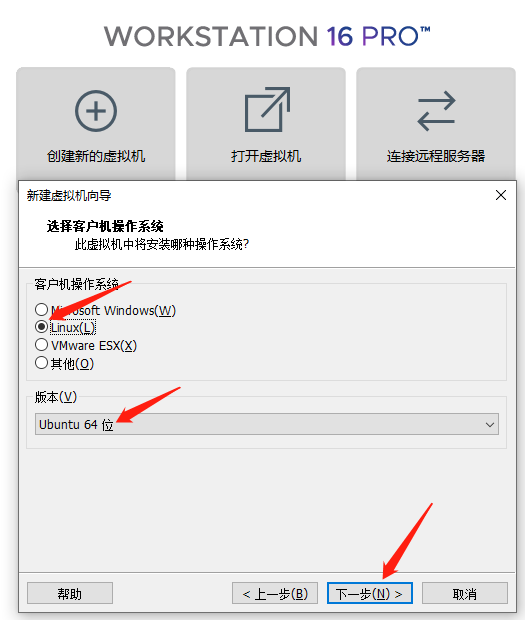

* 设置虚拟机的名字和存放路径


* 选择cpu的数量


> 根据实体机的cpu数量来设置，可以分配一半的cpu到虚拟机中，以加快虚拟机中的编译速度。
如果分配一半的cpu到虚拟机，实体机很卡顿，就要适当减少cpu的分配，这个在后期是可以动态调整的。

* 选择内存大小

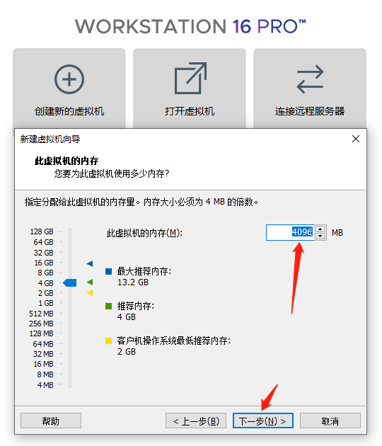

> 根据实体机的内存大小来设置，可以分配一半的内存到虚拟机中，以加快虚拟机的流畅度。
如果分配一半的内存到虚拟机，实体机很卡顿，就要适当减少内存的分配，这个在后期是可以动态调整的。

* 设置磁盘大小


> 不要使用默认置，建议设置成50G。如果后期安装软件较多的话，20G可能就装不下了。

* 设置完成


* 关闭虚拟机的网络连接，加快安装速度

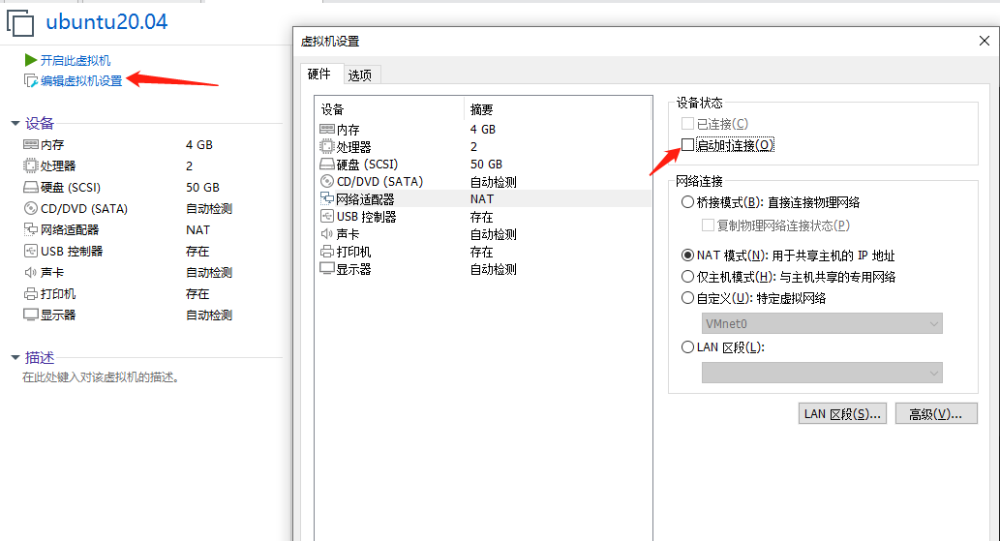

* 指定需要安装的系统ISO路径


* 开启虚拟机


* 安装系统到磁盘


* 选择键盘布局


* 正常安装系统

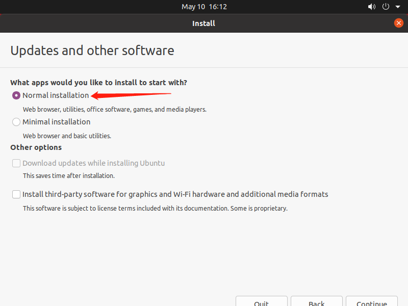

* 擦除整个分配的磁盘


* 选择对应的时区


* 设置用户名和密码

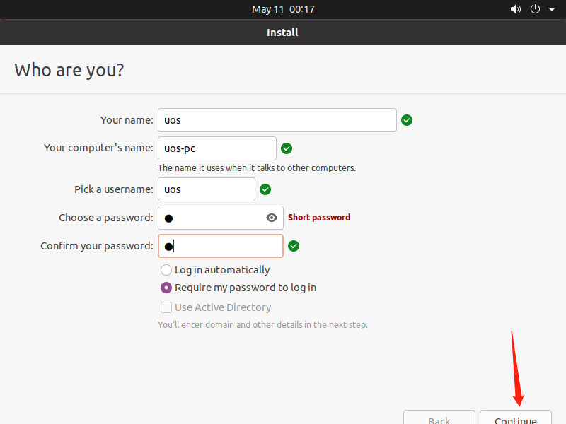

* 到此就设置完毕了，等待系统安装完成

* 重启系统，按ENTER

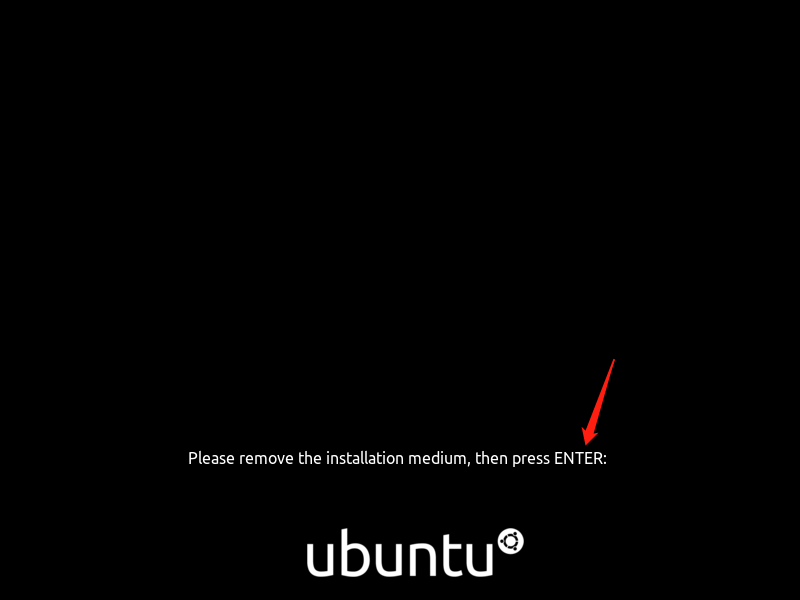

<div STYLE="page-break-after: always;"></div>

## 配置ubuntu虚拟机

---

### 进入系统

---

* 进入系统

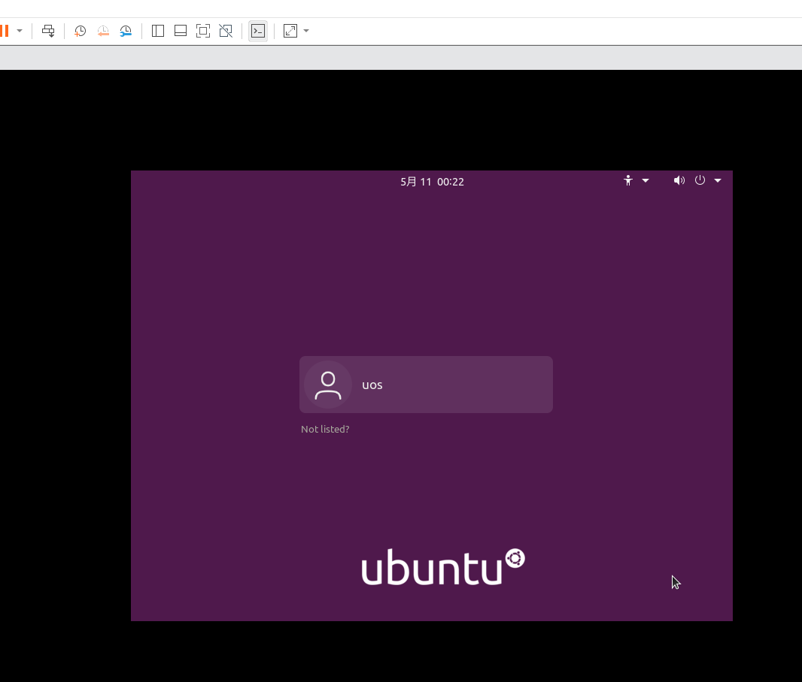

* 初始配置，直接next，直到done


### 安装VMware Tools

---

* 安装VMware Tools后，屏幕可以跟随VMware Workstation窗口自动缩放

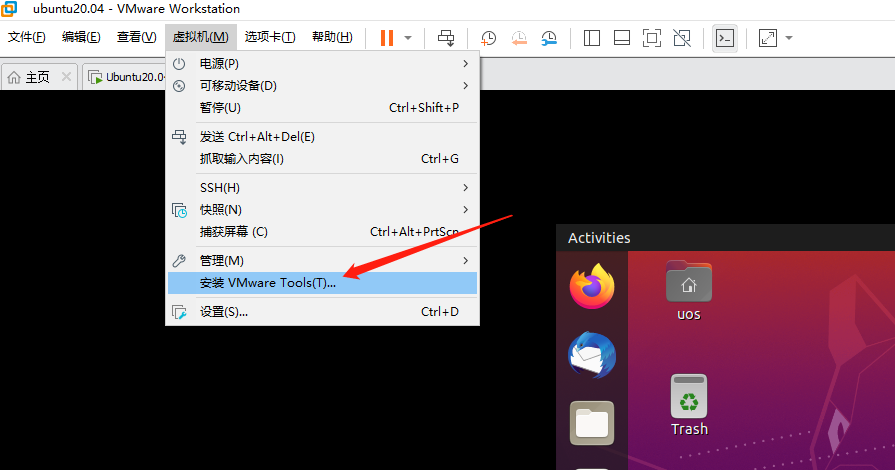

* 进入到DVD目录

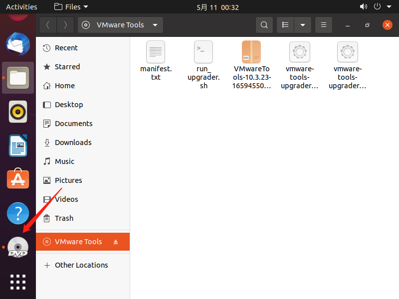

在该目录下点击右键，找到`Open in Terminal`

* 输入如下命令

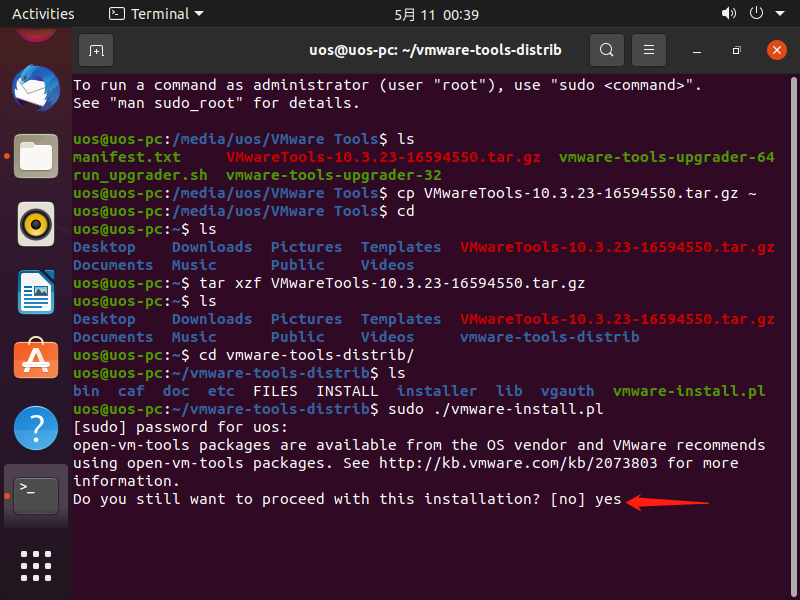

```shell
$ cp VMwareTools-10.3.23-16594550.tar.gz ~
$ cd 
$ ls
$ tar xzf VMwareTools-10.3.23-16594550.tar.gz
$ ls
$ cd vmware-tools-distrib/
$ ls
$ sudo ./vmware-install.pl
```

> note 出现`$`符号的，表示是在命令行输入，下同

期间会有一个错误，直接点Cancel，安装完成后，屏幕自动就放大了

* 关闭系统


### 更新系统

---

* 打开虚拟机的网络


* 使用国内源，加快更新速度

这里使用的是[清华源](https://mirrors.tuna.tsinghua.edu.cn/help/ubuntu/)


* 更换源

在虚拟机中打开浏览器，找到清华源，打开命令行，输入如下命令，并保存退出

```shell
$ cd /etc/apt
$ sudo cp sources.list sources.list-bak
$ sudo gedit sources.list
```
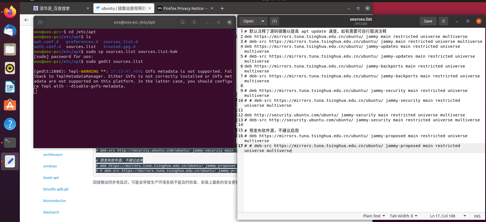

* 更新系统

打开命令行，输入如下命令

```shell
$ sudo apt update
$ sudo apt upgrade -y
```

* 建立虚拟机和主机之间的复制与粘贴

打开命令行，输入如下命令。完成后重启系统就可以和widows进行拷贝和粘贴了。

```shell
$ sudo apt autoremove open-vm-tools
$ sudo apt install open-vm-tools
$ sudo apt install open-vm-tools-desktop
```

* 安装neovim编辑工具

打开命令行，输入如下命令

```shell
$ sudo apt install neovim -y
```

<div STYLE="page-break-after: always;"></div>


## 搭建linux交叉开发环境

---

### 安装gcc

交叉编译：就是编译在宿主机上完成，因为宿主机资源更丰富，编译速度快。编译出的程序不能在宿主机上执行，必须下载到板上执行。

* 安装gcc

```shell
$ tar -xzvf gcc-linaro-7.5.0-2019.12-x86_64_arm-linux-gnueabihf.tar.gz -C /opt/toolchains/nxp/mx6ull
$ cd /opt/toolchains/nxp/mx6ull/gcc-linaro-7.5.0-2019.12-x86_64_arm-linux-gnueabihf/bin
$ ./arm-linux-gnueabihf-gcc -v
Using built-in specs.
COLLECT_GCC=./arm-linux-gnueabihf-gcc
COLLECT_LTO_WRAPPER=/opt/toolchains/nxp/mx6ull/gcc-linaro-7.5.0-2019.12-x86_64_arm-linux-gnueabihf/bin/../libexec/gcc/arm-linux-gnueabihf/7.5.0/lto-wrapper
Target: arm-linux-gnueabihf
Configured with: '/home/tcwg-buildslave/workspace/tcwg-make-release_1/snapshots/gcc.git~linaro-7.5-2019.12/configure' SHELL=/bin/bash --with-mpc=/home/tcwg-buildslave/workspace/tcwg-make-release_1/_build/builds/destdir/x86_64-unknown-linux-gnu --with-mpfr=/home/tcwg-buildslave/workspace/tcwg-make-release_1/_build/builds/destdir/x86_64-unknown-linux-gnu --with-gmp=/home/tcwg-buildslave/workspace/tcwg-make-release_1/_build/builds/destdir/x86_64-unknown-linux-gnu --with-gnu-as --with-gnu-ld --disable-libmudflap --enable-lto --enable-shared --without-included-gettext --enable-nls --with-system-zlib --disable-sjlj-exceptions --enable-gnu-unique-object --enable-linker-build-id --disable-libstdcxx-pch --enable-c99 --enable-clocale=gnu --enable-libstdcxx-debug --enable-long-long --with-cloog=no --with-ppl=no --with-isl=no --disable-multilib --with-float=hard --with-fpu=vfpv3-d16 --with-mode=thumb --with-tune=cortex-a9 --with-arch=armv7-a --enable-threads=posix --enable-multiarch --enable-libstdcxx-time=yes --enable-gnu-indirect-function --with-build-sysroot=/home/tcwg-buildslave/workspace/tcwg-make-release_1/_build/sysroots/arm-linux-gnueabihf --with-sysroot=/home/tcwg-buildslave/workspace/tcwg-make-release_1/_build/builds/destdir/x86_64-unknown-linux-gnu/arm-linux-gnueabihf/libc --enable-checking=release --disable-bootstrap --enable-languages=c,c++,fortran,lto --build=x86_64-unknown-linux-gnu --host=x86_64-unknown-linux-gnu --target=arm-linux-gnueabihf --prefix=/home/tcwg-buildslave/workspace/tcwg-make-release_1/_build/builds/destdir/x86_64-unknown-linux-gnu
Thread model: posix
gcc version 7.5.0 (Linaro GCC 7.5-2019.12)
```

出现上述输出，安装gcc成功

* 配置环境变量，在文件末尾输入如下，然后保存退出

```shell
$ vim ~/.bashrc

export PATH=$PATH:/opt/toolchains/nxp/mx6ull/gcc-linaro-7.5.0-2019.12-x86_64_arm-linux-gnueabihf/bin
```

* 测试导出环境变量是否成功，注意需要重新开一个终端

```shell
$ arm-linux-gnueabihf-gcc -v
Using built-in specs.
COLLECT_GCC=./arm-linux-gnueabihf-gcc
COLLECT_LTO_WRAPPER=/opt/toolchains/nxp/mx6ull/gcc-linaro-7.5.0-2019.12-x86_64_arm-linux-gnueabihf/bin/../libexec/gcc/arm-linux-gnueabihf/7.5.0/lto-wrapper
Target: arm-linux-gnueabihf
Configured with: '/home/tcwg-buildslave/workspace/tcwg-make-release_1/snapshots/gcc.git~linaro-7.5-2019.12/configure' SHELL=/bin/bash --with-mpc=/home/tcwg-buildslave/workspace/tcwg-make-release_1/_build/builds/destdir/x86_64-unknown-linux-gnu --with-mpfr=/home/tcwg-buildslave/workspace/tcwg-make-release_1/_build/builds/destdir/x86_64-unknown-linux-gnu --with-gmp=/home/tcwg-buildslave/workspace/tcwg-make-release_1/_build/builds/destdir/x86_64-unknown-linux-gnu --with-gnu-as --with-gnu-ld --disable-libmudflap --enable-lto --enable-shared --without-included-gettext --enable-nls --with-system-zlib --disable-sjlj-exceptions --enable-gnu-unique-object --enable-linker-build-id --disable-libstdcxx-pch --enable-c99 --enable-clocale=gnu --enable-libstdcxx-debug --enable-long-long --with-cloog=no --with-ppl=no --with-isl=no --disable-multilib --with-float=hard --with-fpu=vfpv3-d16 --with-mode=thumb --with-tune=cortex-a9 --with-arch=armv7-a --enable-threads=posix --enable-multiarch --enable-libstdcxx-time=yes --enable-gnu-indirect-function --with-build-sysroot=/home/tcwg-buildslave/workspace/tcwg-make-release_1/_build/sysroots/arm-linux-gnueabihf --with-sysroot=/home/tcwg-buildslave/workspace/tcwg-make-release_1/_build/builds/destdir/x86_64-unknown-linux-gnu/arm-linux-gnueabihf/libc --enable-checking=release --disable-bootstrap --enable-languages=c,c++,fortran,lto --build=x86_64-unknown-linux-gnu --host=x86_64-unknown-linux-gnu --target=arm-linux-gnueabihf --prefix=/home/tcwg-buildslave/workspace/tcwg-make-release_1/_build/builds/destdir/x86_64-unknown-linux-gnu
Thread model: posix
gcc version 7.5.0 (Linaro GCC 7.5-2019.12)

```

---

### 配置nfs

---

* 安装

```shell
$ sudo apt update
$ sudo apt install -y nfs-kernel-server
```

* 修改配置文件

```shell
$ sudo cp /etc/exports /etc/exports-bak
$ sudo vim /etc/exports 

/opt/nfs 192.168.*.*(rw,async,no_root_squash) 

/opt/filesystem     #目标系统的根文件系统最后映射的路径
*:                  #所有IP都可以和我相连，也可以用某一个具体IP替换
subtree_check:      #子目录权限检查
rw:                 #数据具有写权限
no_root_squash:     #当访问这个目录，具有root权限
async:              #动态同步
```

* 创建挂载目录

```shell
$ mkdir /mnt/nfs
$ chmod 777 /mnt/nfs
```

* 重启服务端

```
$ sudo systemctl restart nfs-kernel-server
```

### 配置ssh

---

* 安装
```
$ sudo apt update
$ sudo apt install -y openssh-server
```

* 配置

配置文件路劲: /etc/ssh/sshd_config

* ssh服务默认的端口是`22`，可以更改端口，一般不修改

```shell
$ ssh test@192.168.1.205 -p 3344
```

> 配置文件修改后，需要重新启动服务

* 相关操作命令

```shell
$ sudo service ssh start
$ sudo service ssh restart
$ sudo service ssh stop

$ ps -e | grep sshd
 177305 ?        00:00:00 sshd
```

### 开发板测试

---

* 编写测试代码，保存为`hello_world.c`

---

```shell
$ cd /mnt/nfs
$ vim hello_world.c
```

```c
#include <stdio.h>

int main(int argc, char *argv[])
{
    printf("hello world \n");
    return 0;
}
```

* 交叉编译

```shell
$ arm-linux-gnueabihf-gcc hello_world.c -o hello_world
$ ls
hello_world  hello_world.c
```

* 通过串口设置开发板的静态ip，板子不同设置方式也有些许不同

```shell
$ sudo mv /etc/network/interfaces /etc/network/interfaces.save
$ sudo vim /etc/systemd/network/20-eth1-static.network
[Match]
Name=eth1

[Network]
Address=192.168.0.16/24
DNS=192.168.0.1

[Route]
Gateway=192.168.0.1
Metric=100
$ sudo systemctl enable systemd-networkd
```

* 重启开发板，在宿主机上测试刚配置的ip是否起作用

```shell
$ ping 192.168.0.16
PING 192.168.0.16 (192.168.0.16) 56(84) bytes of data.
64 bytes from 192.168.0.16: icmp_seq=1 ttl=64 time=2.70 ms
64 bytes from 192.168.0.16: icmp_seq=2 ttl=64 time=2.45 ms
64 bytes from 192.168.0.16: icmp_seq=3 ttl=64 time=2.82 ms
^C
--- 192.168.0.16 ping statistics ---
3 packets transmitted, 3 received, 0% packet loss, time 2004ms
rtt min/avg/max/mdev = 2.445/2.654/2.821/0.156 ms
```

* 使用`ssh`登入

```shell
$ ssh root@192.168.0.16
输入密码
```

* 通过`nfs`挂在到宿主机上

```shell
$ mkdir /mnt/nfs
$ mount -t nfs -o nolock 192.168.0.252:/mnt/nfs /mnt/nfs
$ cd /mnt/nfs/
$ ./hello_world
hello world
```
