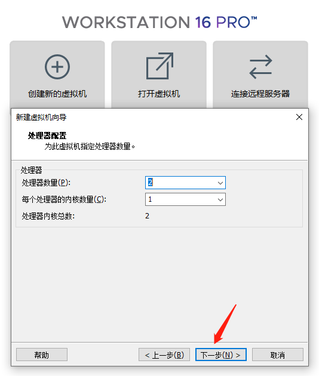

# 搭建linux交叉开发环境

---

[TOC]

## 安装ubuntu虚拟机

---

### 安装VMware Workstation

---

到网上找一个安装包，直接下一步安装

### 安装ubuntu系统

---

> note: 没有特别说明的，选择默认值，直接下一步

* 选择创建虚拟机


* 选择稍后安装系统


* 选择安装系统的类型


* 设置虚拟机的名字和存放路径


* 选择cpu的数量



> 根据实体机的cpu数量来设置，可以分配一半的cpu到虚拟机中，以加快虚拟机中的编译速度。
如果分配一半的cpu到虚拟机，实体机很卡顿，就要适当减少cpu的分配，这个在后期是可以动态调整的。

* 选择内存大小


> 根据实体机的内存大小来设置，可以分配一半的内存到虚拟机中，以加快虚拟机的流畅度。
如果分配一半的内存到虚拟机，实体机很卡顿，就要适当减少内存的分配，这个在后期是可以动态调整的。

* 设置磁盘大小


> 不要使用默认置，建议设置成50G。如果后期安装软件较多的话，20G可能就装不下了。

* 设置完成


* 关闭虚拟机的网络连接，加快安装速度


* 指定需要安装的系统ISO路径


* 开启虚拟机


* 安装系统到磁盘


* 选择键盘布局


* 正常安装系统


* 擦除整个分配的磁盘


* 选择对应的时区


* 设置用户名和密码


* 到此就设置完毕了，等待系统安装完成

* 重启系统，按ENTER


## 配置ubuntu虚拟机

---

### 进入系统

---

* 进入系统


* 初始配置，直接next，知道done


### 安装VMware Tools

---

* 安装VMware Tools，屏幕的放大


* 进入到DVD目录


在该目录下点击右键，找到`Open in Terminal`

* 输入如下命令


```shell
cp VMwareTools-10.3.23-16594550.tar.gz ~
cd 
ls
tar xzf VMwareTools-10.3.23-16594550.tar.gz
ls
cd vmware-tools-distrib/
ls
sudo ./vmware-install.pl
```

期间会有一个错误，直接点Cancel，安装完成后，屏幕自动就放大了

* 关闭系统


### 更新系统

---

* 打开虚拟机的网络


* 使用国内源，加快更新速度

这里使用的是[清华源](https://mirrors.tuna.tsinghua.edu.cn/help/ubuntu/)


* 更换源

在虚拟机中打开浏览器，找到清华源，打开命令行，输入如下命令，并保存退出

```shell

```


* 更新系统

打开命令行，输入如下命令

```shell
sudo apt update
sudo apt upgrade -y
```

* 建立虚拟机和主机之间的复制与粘贴

打开命令行，输入如下命令

```shell

```

* 安装neovim编辑工具

打开命令行，输入如下命令

```shell

```


## 搭建linux交叉开发环境

---

### 安装gcc

---

### 配置nfs

---

### 配置ssh

---

### 编写测试代码

---

### 开发板测试

---


