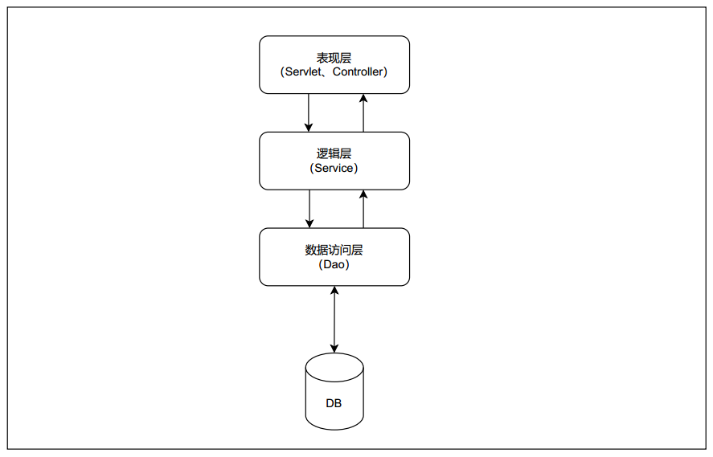
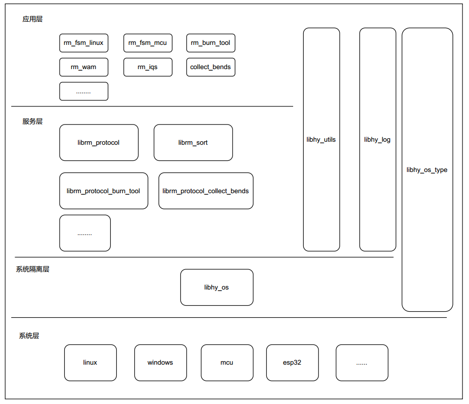

# 架构分层

[TOC]

## 概述

#### 不采用架构分层，行不行

---

答案是肯定的。但是不采用架构分层，会带来极大的未知风险。

作为一个初创软件，可能没有什么业务逻辑，没有什么用户量，而软件最主要的目标就是快速上线，实践商业模式。此时，可以不考虑分层。但随着业务逻辑的复杂，业务板块的增多，彼此之间就会出现错综复杂的依赖关系，随之就会产生的逻辑不清晰、可读性差，维护困难，改动一处动全身等问题。

#### 什么是架构分层

---

分层架构是将软件模块按照水平切分的方式分成多个层，一个系统由多层组成，每层由多个模块组成。同时，每层有自己独立的职责，多个层次协同提供完整的功能。比如，我们经常提到的MVC架构，就是一种非常典型非常基础的分层方式。

分层设计的本质其实就是将复杂问题简单化，基于单一职责原则让每层代码各司其职，基于“高内聚，低耦合”的设计思想实现相关层对象之间的交互。从而，提升代码的可维护性和可扩展性。

系统架构分层之后，往往需要达到以下目标：

* 高内聚：分层设计可以简化系统设计，让不同层专注做某一模块的事；
* 低耦合：层与层之间通过接口或API来交互，依赖方不用知道被依赖方的细节；
* 复用：分层之后可以做到代码或功能的复用；
* 扩展性：分层架构可以让代码更容易横向扩展

#### 经典三层架构

---

三层架构，通常就是将整个业务应用划分为：表现层（UI）、业务逻辑层（BLL）、数据访问层（DAL）。

* 表现层（UI），通俗讲就是展现给用户的界面，对应项目中的Web层包含Servlet和Controller等。

* 业务逻辑层（BLL）：也称作领域层，负责系统业务逻辑的处理，对应项目中Service和ServiceImpl等。

* 数据访问层（DAL）：该层所做事务直接操作数据库，针对数据的增添、删除、修改、更新、查找等，对应项目中的Dao。

## 总体概括图

#### 各层的作用

---

* 应用层：主要实现与"用户"的信息交流，比如UI，比如主导信息流的方向等。

* 服务层：对某一功能的封装，提供输入和输出接口，比如通信协议，比如访问数据库操作

* 系统隔离层： 用于屏蔽不同系统，不同芯片的差异，向上提供统一的api调用

* 系统层：主要是各种各样的系统，或者mcu等裸机开发等。

#### 各层库说明

---

##### libhy_os_type

* 提供统一的数据长度定义, 避免后期因为32位系统或64位系统数据类型长度不一致导致的问题。
* 统一总体项目的格式定义，方便代码的理解与阅读。
* 该库可以跨越多层使用。

##### libhy_os

* 提供统一的api调用方式，隔离底层硬件的变化。

##### libhy_log

* 提供统一的log输出，方便各个库和总体项目的调试。
* 可以提供多种输出方式，比如串口、网络、写入文件等。
* 该库可以跨越多层使用。

##### libhy_utils

* 提供单一功能的封装，方便开发或代码复用。
* 该层的函数不依赖系统（需要依赖系统api的，需要放到libhy_os库中）。
* 该库可以跨越多层使用。

##### librm_protocol

* 封装通信协议，提供api给到上层调用。
* 同时提供给client和服务端，方便统一的协议升级。

##### librm_sort

* 分选主要逻辑

##### rm_fsm_linux

* 相关库的初始化
* 组织数据流向

> 该架构已经在FSM_LINUX和esp32的折弯机上使用，目前还不完善，还有很多需要改进。稳定后可以把FSM_LINUX代码直接移到单片机上运行。

